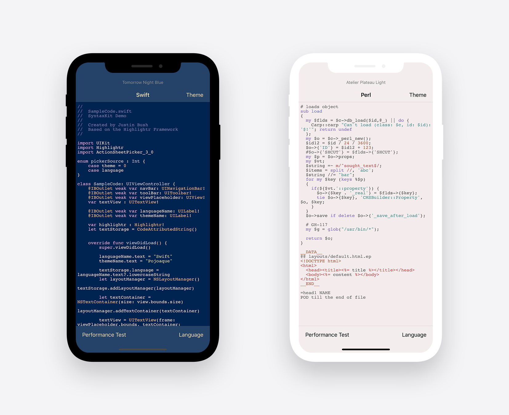

# SyntaxKit Demo
A solid framework for presenting a programming language on the iOS and macOS platforms. Built for compatibility with real-time syntax highlighting when programming. Updated for iOS 13, macOS 10.15 (Catalina) and iPhone 11 Max/Pro.



Based on the <a href="https://github.com/raspu/Highlightr">Highlightr framework</a>.

## SwiftUI Build <sup>BETA</sup>
Now available in the <a href="https://github.com/revblaze/SyntaxKit/tree/master/SwiftUI%20Demo">SwiftUI Demo</a> folder.

## Known Errors
None as of yet.

## References
None as of yet.

## Requirements
 - Requires iOS 9.0 or later.
 - Requires macOS 10.11 or later.
 
 <i>Please note that the app is being built with Swift 5.</i>

## MIT License

Copyright © 2020 Justin Bush. All rights reserved.

```
Permission is hereby granted, free of charge, to any person obtaining a copy
of this software and associated documentation files (the "Software"), to deal
in the Software without restriction, including without limitation the rights
to use, copy, modify, merge, publish, distribute, sublicense, and/or sell
copies of the Software, and to permit persons to whom the Software is
furnished to do so, subject to the following conditions:

The above copyright notice and this permission notice shall be included in
all copies or substantial portions of the Software.

THE SOFTWARE IS PROVIDED "AS IS", WITHOUT WARRANTY OF ANY KIND, EXPRESS OR
IMPLIED, INCLUDING BUT NOT LIMITED TO THE WARRANTIES OF MERCHANTABILITY,
FITNESS FOR A PARTICULAR PURPOSE AND NONINFRINGEMENT. IN NO EVENT SHALL THE
AUTHORS OR COPYRIGHT HOLDERS BE LIABLE FOR ANY CLAIM, DAMAGES OR OTHER
LIABILITY, WHETHER IN AN ACTION OF CONTRACT, TORT OR OTHERWISE, ARISING FROM,
OUT OF OR IN CONNECTION WITH THE SOFTWARE OR THE USE OR OTHER DEALINGS IN
THE SOFTWARE.
```
